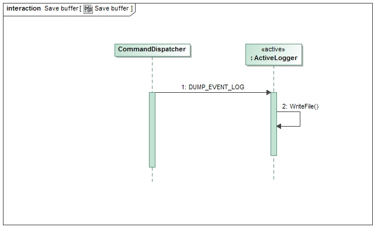

<title>Svc::ActiveLogger Component SDD</title>
# Svc::ActiveLogger Component

## 1. Introduction

The `Svc::ActiveLogger` component processes events from other components. The events are put in packets and sent to an external user like a ground system. The component provides event filtering and writing event logs to a file.

## 2. Requirements

The requirements for `Svc::ActiveLogger` are as follows:

Requirement | Description | Verification Method
----------- | ----------- | -------------------
AL-001 | The `Svc::ActiveLogger` component shall store events. | Inspection; Unit Test
AL-002 | The `Svc::ActiveLogger` component shall store a configurable circular buffer of events by severity. | Unit Test
AL-003 | The `Svc::ActiveLogger` component shall write the circular buffers to a file upon command | Unit Test
AL-004 | The `Svc::ActiveLogger` component shall have commands to filter events based on event severity. | Unit Test
AL-005 | The `Svc::ActiveLogger` component shall filter events on receipt of the event on the caller's thread but before being placed in the event buffer. | Unit Test
AL-006 | The `Svc::ActiveLogger` component shall filter events on the thread of the component before sending them as packets, but after they have been stored in the circular buffers | Unit Test
AL-007 | The `Svc::ActiveLogger` component shall filter events based on the event ID. | Unit Test 

## 3. Design

### 3.1 Context

#### 3.1.1 Component Diagram

The `Svc::ActiveLogger` component has the following component diagram:

#### 3.1.2 Ports

The `Svc::ActiveLogger` component uses the following port types:

Port Data Type | Name | Direction | Kind | Usage
-------------- | ---- | --------- | ---- | -----
[`Fw::Log`](../../../Fw/Log/docs/sdd.html) | LogRecv | Input | Synchronous | Receive events from components
[`Fw::Com`](../../../Fw/Log/docs/sdd.html) | PktSend | Output | n/a | Send event packets to external user
[`Svc::FatalEvent`](../../../Svc/Fatal/docs/sdd.html) | FatalAnnounce | Output | n/a | Send FATAL event (to health)

### 3.2 Functional Description

The `Svc::ActiveLogger` component provides an event logging function for the software. The framework autocoder allows developers to specify a set of events in the component XML (see User's Guide). For those components, the autocoder will add an `Fw::Log` output port to send events in serialized form. The ActiveLogger filters the events and sends them as packets to other components that send them out of the system.

NOTE: Event ID value 0 is reserved for the logger.

#### 3.2.1 Filtering

The `Svc::ActiveLogger` `LogRecv` input port handler filters events on the thread of the caller to lessen the CPU load caused by sending events via IPC to the component thread. The filters can be set by severity. By default, the DIAGNOSTIC events are filtered since the number can be the highest and are typically only used for development and debugging. This input filter is modified by the `SET_EVENT_REPORT_FILTER` command.

The thread of the component retrieves the log events from the message queue and stores them in a circular buffer by event severity. There is a second filter that determines whether or not the the event will be converted to a packet and sent via the `PktSend` port. This allows more events to be stored in the circular buffers than are sent, so that in the event more diagnostic data is needed the event buffers can be dumped. This input filter is modified by the `SET_EVENT_SEND_FILTER` command.

The component also allows filtering events by event ID. There is a configuration parameter that sets the number of IDs that can be filtered. This allows operators to mute a particular event that might be flooding the event queue. This filter can be set on either receipt of the event or prior to sending the event. In most cases, it is desirable to filter on receipt so a flooding event does not overwhelm the message queue. These filters is modified by the `SET_EVENT_ID_REPORT_FILTER` and `SET_EVENT_ID_SEND_FILTER` command.

#### 3.2.2 Log Buffers

The component has a set of circular buffers that store a history of events. The depth of the filters is configurable. The set of events stored in the buffers are those that pass the input filters and are queued for the component thread. The intent is that the larger set of events than those sent can be stored in the buffers and dumped to a file if needed. The `DUMP_EVENT_LOG` command will dump the contents of a log to a file.

#### 3.2.3 Fatal Announce

When the `ActiveLogger` component receives a FATAL event, it calls the FatalAnnounce port. Another component that has a system response to FATALs (such as reset) can connect to the port to be informed when a FATAL has occurred.

### 3.3 Scenarios

#### 3.3.1 Receive Events

The `Svc::ActiveLogger` component accepts events from other components:

 

#### 3.3.1 Save Buffer

The `Svc::ActiveLogger` component write event buffers to a file:

 

### 3.4 State

`Svc::ActiveLogger` has no state machines.

### 3.5 Algorithms

`Svc::ActiveLogger` has no significant algorithms.

## 4. Dictionaries

Dictionaries: [HTML](ActiveLogger.html) [MD](ActiveLogger.md)

## 5. Module Checklists

Document | Link
-------- | ----
Design Checklist | [Link](Checklist_Design.xlsx)
Code Checklist | [Link](Checklist_Code.xlsx)
Unit Test Checklist | [Link](Checklist_Unit_test.xlsx)

## 6. Unit Testing

[Unit Test Output](../test/ut/output/test.txt)

[Coverage Output - `ActiveLoggerImpl.cpp`](../test/ut/output/ActiveLoggerImpl.cpp.gcov)

[Coverage Output - `ActiveLoggerComponentAc.cpp`](../test/ut/output/ActiveLoggerComponentAc.cpp.gcov)

[Report](../test/ut/output/SvcActiveLogger_gcov.txt)

## 7. Change Log

Date | Description
---- | -----------
6/25/2015 | Design review edits
7/22/2015 | Design review actions
9/7/2015 | Unit Test updates 
10/28/2015 | Added FATAL announce port

