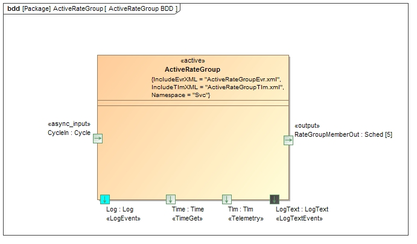
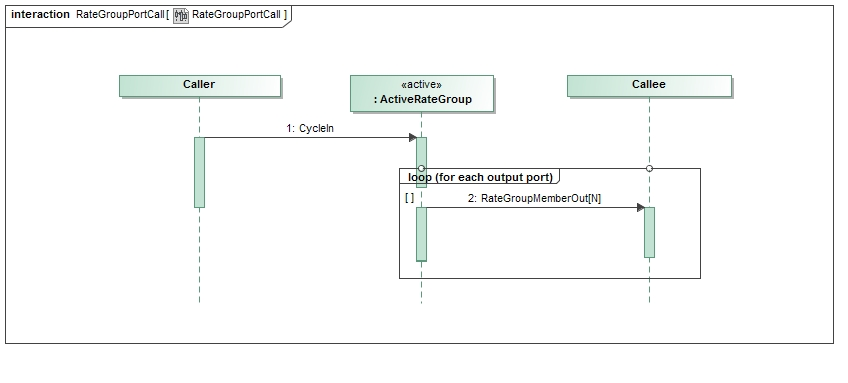

<title>ActiveRateGroup Component SDD</title>
# RateGroupDriver Component

## 1. Introduction

`Svc::ActiveRateGroup` is an active component that drives a set of components connected to `Svc::Sched` output ports. 
It contains an asynchronous input `Svc::Cycle` port. This port sends a message which wakes the component task. 
The task invokes each output port in order, passing an argument indicating the order. It tracks execution time and detects overruns.

## 2. Requirements

The requirements for `Svc::ActiveRateGroup` are as follows:

Requirement | Description | Verification Method
----------- | ----------- | -------------------
ARG-001 | The `Svc::ActiveRateGroup` component shall be active and will be woken up by an input asynchronous port call | Inspection, Unit test
ARG-002 | The `Svc::ActiveRateGroup` component shall invoke its output ports in order, passing the value contained in a table based on port number | Unit Test
ARG-003 | The `Svc::ActiveRateGroup` component shall track the time required to execute the rate group and report it as telemetry | Unit Test
ARG-004 | The `Svc::ActiveRateGroup` component shall report a warning event when a rate group cycle is started before previous is completed  | Unit Test

## 3. Design

### 3.1 Context

#### 3.1.1 Component Diagram

The `Svc::ActiveRateGroup` component has the following component diagram:

#### 3.1.2 Ports

The `Svc::ActiveRateGroup` component uses the following port types:

Port Data Type | Name | Direction | Kind | Usage
-------------- | ---- | --------- | ---- | -----
[`Svc::Cycle`](../../Cycle/docs/sdd.html) | CycleIn | Input | Asynchronous | Receive a call to run one cycle of the rate group
[`Svc::Sched`](../../Sched/docs/sdd.html) | RateGroupMemberOut | Output | n/a | Rate group ports

#### 3.2 Functional Description

The `Svc::ActiveRateGroup` component has one input port that is called to wake up the task to execute one cycle.  
The task of the component calls the output ports in order, passing the context from the context list as the port argument. 

The component sets a flag when the cycle port is invoked. At the beginning of the rate group execution, the component clears 
the flag. 
If it detects that it has been set again at the end of the rate group cycle, it will declare a cycle slip, send an 
event, and increase the cycle slip counters. 

### 3.3 Scenarios

#### 3.3.1 Rate Group Port Call

As described in the Functional Description section, the `Svc::ActiveRateGroup` component accepts calls to the CycleIn and invokes the RateGroupMemberOut ports:

 

### 3.4 State

`Svc::ActiveRateGroup` has no state machines.

### 3.5 Algorithms

`Svc::ActiveRateGroup` has no significant algorithms.

## 4. Dictionaries

Dictionaries: [HTML](ActiveRateGroup.html) [MD](ActiveRateGroup.md)

## 5. Module Checklists

Document | Link
-------- | ----
Design Checklist | [Link](Checklist_Design.xlsx)
Code Checklist | [Link](Checklist_Code.xlsx)
Unit Test Checklist | [Link](Checklist_Unit_Test.xlsx)

## 6. Unit Testing

The unit test results are as follows:

Log|Link
---|----
Test Output|[Link](../test/ut/output/test.txt)
Coverage Output|[Link](../test/ut/output/ActiveRateGroupImpl.cpp.gcov)

## 7. Change Log

Date | Description
---- | -----------
6/22/2015 | Design review edits
7/22/2015 | Design review actions
8/10/2015 | Updated to cycle input port 
8/31/2015 | Unit test review updates

