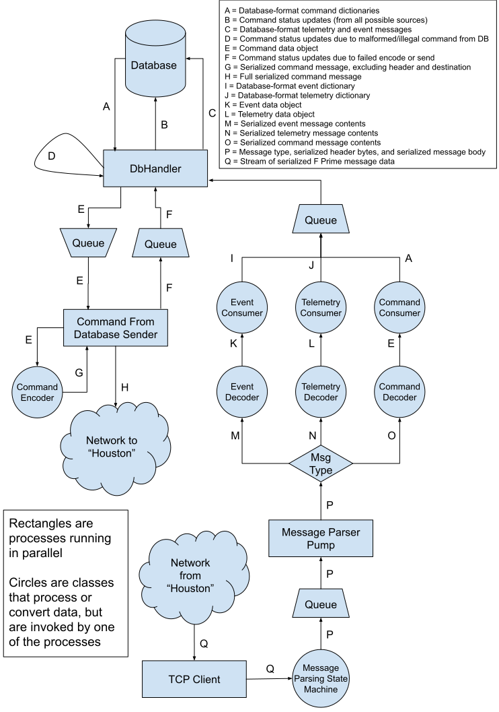

### Notes
- The ground backend can only be run on Linux.
- The teleoperation backend requires Python 3.5 or newer in order to run.
- In these instructions, the root of the CubeRoverPackage repository will be referred to as `<ROOT>`, `<ROOT>/GroundSoftware/Backend` will be referred to as `<BACKEND_ROOT>`, and `<ROOT>/FlightSoftware/Apps/fprime` will be referred to as `<FPRIME_ROOT>`
### Set-up
1. Change directory to `<BACKEND_ROOT>`
2. Install the prerequisite Python packages:
    ```
    python3 -m pip install --user -r cuberover/requirements.txt
    python3 -m pip install --user -r ../../../../FlightSoftware/Apps/fprime/Autocoders/Python/requirements.txt
    ```
3. Install prerequisites of building F Prime:
    1. Download and install Code Composer Studio 9.1 in the **default** directory. [Link to download.](https://software-dl.ti.com/ccs/esd/CCSv9/CCS_9_1_0/exports/CCS9.1.0.00010_linux-x64.tar.gz)
    2. Assuming the downloaded file ended up in `~/Downloads`:
        1. `cd ~/Downloads`
        2. `tar -xvf CCS9.1.0.00010_linux-x64.tar.gz`
        3. `cd CCS9.1.0.00010_linux-x64/`
        4. `sudo apt-get install libusb-0.1-4`
        5. `./ccs_setup_linux64_9.1.0.00010.bin`
        6. Progress through the installation, and select MSP430 and Hercules processors when prompted.
    3. `sudo apt-get install python-lxml python-cheetah`
4. Prepare and build F Prime: 
    1. Change directory to `<FPRIME_ROOT>`
    2. Open `mk/configs/compiler/defines_ccs.mk` and ensure that the path and version match your Code Composer Studio installation.
    3. Run the following commands to build:
        1. `./configure`
        2. `cd Os`
        3. `make gen_make`
        4. `make TIR4`
        5. `cd ../Fw`
        6. `make TIR4`
        7. `cd ../Svc`
        8. `make TIR4`
        9. `cd ../Drv`
        10. `make TIR4`
        11. `cd ..`
        12. `./install_libs.sh`
        13. `cd CubeRover`
        14. `make TIR4`
        15. Note that it is OK and currently expected for the final `make` command to end in an error. What's important is to verify that inside of the current directory (which should be `CubeRover`), there should now be a directory named `py_dict`, and inside of that directory there should be three more directories: `channels`, `commands`, and `events`. Finally, the `py_dict/commands` directory should contain at least `Navigation.py` and `Response.py`.
5. Install prerequisites for running the YAMCS test server:
   ```bash
   sudo apt update && sudo apt install -y openjdk-8-jre-headless maven
   ```
### Back-end verification
Verifying the back-end requires four terminals. In all four terminals, the current working directory should be `<BACKEND_ROOT>`.
1. In the first terminal, start the test YAMCS server:
    ```bash
    ./start_test_yamcs_server.sh
    ```
2. In the second terminal, start the teleop_fake_rover:
    ```bash
    python3 cuberover/teleop_backend/teleop_fake_rover.py --server-address 127.0.0.1 --server-port 10025 --response-port 10015 --generated_file_directory "../../FlightSoftware/Apps/fprime/CubeRover/py_dict"
    ```
3. In the third terminal, start the teleop_backend:
    ```bash
    python3 cuberover/teleop_backend/teleop_backend_main.py \
        --address 127.0.0.1 \
        --port 8090 \
        --yamcs_username "example" \
        --yamcs_password "justanexample" \
        --yamcs_instance "Astrobotic-M1" \
        --yamcs_processor "realtime" \
        --yamcs_command "/Astrobotic-M1/simple-udp-example-tc" \
        --yamcs_parameter "/Astrobotic-M1/simple-udp-example-payload-tm" \
        --generated_file_directory "../../FlightSoftware/Apps/fprime/CubeRover/py_dict"
    ```
4. In the fourth terminal, start the teleop_fake_frontend:
    ```bash
    python3 cuberover/teleop_backend/teleop_fake_frontend.py
    ```
5. With all three of these commands running, you should be seeing activity in all three terminals:
    - The terminal running `teleop_fake_frontend.py` will be spitting out the commands it is writing to the database
    - The terminal running `teleop_backend_main.py` will be spitting out updates as it pulls commands from the database, sends them out over TCP, and then writes status updates back to the database
    - The terminal running `teleop_fake_rover.py` will be spitting out how many bytes it receives when it reads data from it's UDP port, the parsed command it received, and whether sending the Response was successful.

Note that the `python3` command might not exist on your machine, particularly if you're running on Windows. In that case, confirm you have python 3.5 or newer installed by running `python --version`, and if that's the case then you can just replace `python3` in the above commands with `python`. If not, you need to install python 3.5 or newer.

### Data Flow Diagram

##### Some notes on the data flow diagram:
- The overall pipeline is constructed in the file `<BACKEND_ROOT>/cuberover/teleop_backend/pipeline/pipeline.py`.
- In the code, the queues in the diagram go by the following names:
    - The top left queue in the diagram, which is fed by the "DbHandler" and consumed by the "Command From Database Sender", goes by "new command output queue"
    - The top middle queue in the diagram, which is fed by the "Command From Database Sender" and consumed by the "DbHandler", goes by "command status update queue"
    - The top right queue in the diagram, which is fed by the Event, Telemetry, and Command Consumers and consumed by the "DbHandler", goes by "received database object queue"
    - The bottom right queue in the diagram, which is fed by the "Message Parsing State Machine" and consumed by the "Message Parser Pump", goes by "received serialized message queue"
- In the code, the four processes in the diagram are performed by the following task functions:
    - The "DbHandler" process is performed by `DbHandlerProcess.db_interaction_task`, which is located in the file `<BACKEND_ROOT>/cuberover/teleop_backend/database/multiprocess_db_handler.py`
    - The "Command From Database Sender" process is performed by `Pipeline.send_cmd_from_db` called repeatedly using a `Pipeline.MultiprocessingRunner`, both of which are located in the file `<BACKEND_ROOT>/cuberover/teleop_backend/pipeline/pipeline.py`
    - The "Message Parser Pump" process is performed by `Pipeline.transfer_msg_from_parser_queue_to_decoder` called repeatedly using a `Pipeline.MultiprocessingRunner`, both of which are located in the file `<BACKEND_ROOT>/cuberover/teleop_backend/pipeline/pipeline.py`
- The circled classes in the diagram represent the following classes in the code:
    - "Command Encoder" represents the class `CmdEncoder`, which is located in the file `<FPRIME_ROOT>/Gds/src/fprime_gds/common/encoders/cmd_encoder.py`
    - "Event Decoder" represents the class `EventDecoder`, which is located in the file `<FPRIME_ROOT>/Gds/src/fprime_gds/common/decoders/event_decoder.py`
    - "Telemetry Decoder" represents the class `ChDecoder`, which is located in the file `<FPRIME_ROOT>/Gds/src/fprime_gds/common/decoders/ch_decoder.py`
    - "Command Decoder" represents the class `CmdDecoder`, which is located in the file `<BACKEND_ROOT>/cuberover/teleop_backend/fprime_gds_additions/common/decoders/cmd_decoder.py`
    - "Event Consumer" represents the class `EventConsumer`, which is located in the file `<BACKEND_ROOT>/cuberover/teleop_backend/pipeline/consumers/event_consumer.py`
    - "Telemetry Consumer" represents the class `TelemetryConsumer`, which is located in the file `<BACKEND_ROOT>/cuberover/teleop_backend/pipeline/consumers/telemetry_consumer.py`
    - "Command Consumer" represents the class `CommandConsumer`, which is located in the file `<BACKEND_ROOT>/cuberover/teleop_backend/pipeline/consumers/command_consumer.py`
    - "Message Parsing State Machine" represents the class `MessageParsingStateMachine`, which is located in the file `<BACKEND_ROOT>/cuberover/teleop_backend/network/message_parsing_state_machine.py`
    - The "YAMCS Client" represents the class `YamcsClient` which is located in the file `<BACKEND_ROOT>/cuberover/teleop_backend/network/yamcs_client.py`

