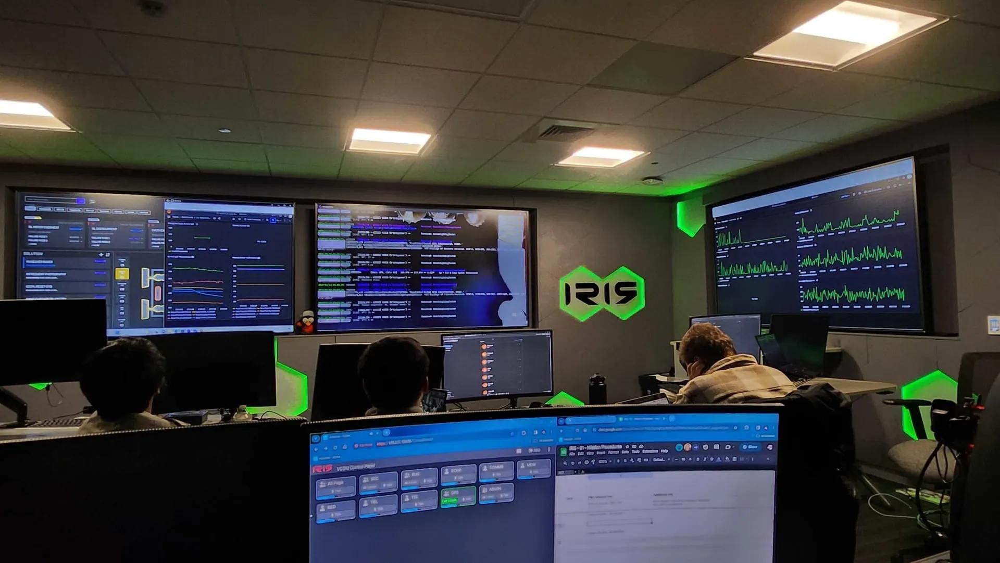
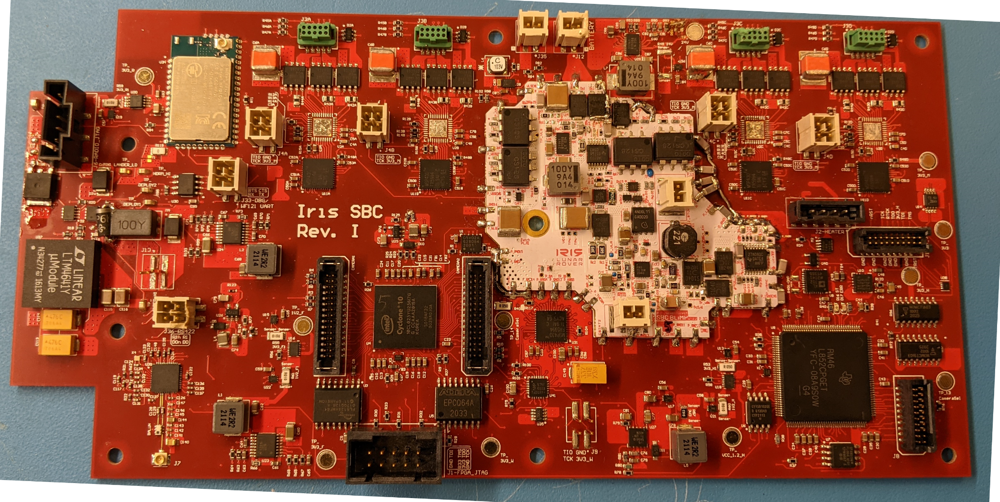

# IrisRoverPackage
Complete software package for the Iris Lunar Rover (CMU), both FSW and GSW as it was during [Iris' 2024 mission to the Moon (and back)](https://www.nytimes.com/2024/02/09/science/iris-carnegie-mellon-moon-rover.html).


**NOTE**: This repository used to be called `CubeRoverPackage`. For legacy reasons, the URL `https://github.com/PlanetaryRobotics/CubeRoverPackage` still works along with all its subpages. The name `CubeRoverPackage` predates the split of CubeRover and Iris Lunar Rover. This codebase is entirely unaffiliated with `CUBEROVER™`, a trademark of Astrobotic Technology.

## Structure
This monorepository contains all the mission-critical code across all areas of the Iris Lunar Rover. 
- The `Apps` directory contains all the different levels of software (Flight, Backend GDS, Frontend GUI).
- The `Bins` directory key artifacts from different checkpoints in the program, which some `Apps` ingest.
- The `Libs` directory contains code which is used for multiple targets, namely the ICD for the Motor Controller.

Below are the key packages that can be found in the `Apps` directory:
### `Apps/FlightSoftware`
Software and Firmware deployed directly any of the processors onboard the rover (Primary Flight CPU, Watchdog, Camera FPGA, Radio). Note: the Primary Flight CPU (Hercules) features both core FreeRTOS system as well as the JPL `FPrime` framework.


### `Apps/GroundSofware`
The `IrisBackendv3` backend Ground Data System (GDS) used to uplink data (commands and binaries) to the rover and ingest data (telemetry and files) downlinked from the rover, process it, validate it, extrapolate new data, and distribute that data across all mission-control connected systems via a ZeroMQ-based pub-sub architecture.


### `Apps/FrontendSoftware`
Electron-based stateless frontend terminal used to interact with the GDS. In mission, this system was largely supplanted by FLEUR and the GroundSoftware GDS GUI so it is not present in `master`. The latest release can be found in `frontend-0.8.2rc` and the latest dev version in `cwcolomb/ipc-integration-for-moc`.

## Development
### Containerization
At the beginning of this project in 2019, containerization was still fairly niche. By mission, the Ground Software ended up being fully containerized; however, the flight-software required a notoriously picky build process.  Post mission, a generally successful but incomplete effort was made to containerize the full FSW build-process. This can be found at `cwcolomb/fm2-dockerize-fsw`. It is recommended that any attempts to generate new FSW setups start there.

### Highlevel Late-Stage Branching Philosophy:
The following is the policy for branching as of mid-2022 in the lead up to mission as final FSW release candidates are prepared.

#### General Branching Structure:
```
                           master
                             |                                     
                             |                                  |-
                       master-staging - - - - - - - - - - - - - |-  ...  [GSW feature branches]
                             |                                  |-
                             |
                     release-candidate
                         |   |   |
                   [RC feature branches]
```

#### Branch Definitions:
- `master`: Complete Iris Lunar Rover Software Package.
- `master-staging`: Draft code for `master`. Only contains **released** FSW (FSW that's on the Flight Rover).
    - Used for performing integrated tests of the full software stack.
- `release-candidate`: Draft FSW + GSW used for a Release Candidate (RC) in preparation for a **Flight Release** (uploading code to the Flight Rover).
    - Every time code is uploaded to the flight rover, that constitutes a new **Flight Release**, at which point `release-candidate` is PR'd into `master-staging`.
    - Release Candidates that became Flight Releases can be found using `tags` (e.g. [`RC5`](https://github.com/PlanetaryRobotics/IrisRoverPackage/releases/tag/rc5), [`RC6`](https://github.com/PlanetaryRobotics/IrisRoverPackage/releases/tag/rc6), etc.). For tracking purposes, these preserve their "`RC`" names.
- `[RC feature branches]`: Feature / bug-fix branches containing FSW changes required for a new **Flight Release**.
    - Only get pushed to `release-candidate` when the features are ready for a Flight Release (i.e. done and tested).
    - Can also contain GSW changes if *directly related* to FSW changes (e.g. a new serialized type is added FSW that requires new serialization code in GSW).
- `[GSW feature branches]`: GSW-only feature / bug-fix branches that are independent of FSW feature changes / need access to the **latest Flight Release**.
    - This is important because some GSW features compile FSW for message definitions. For the sake of accurate testing, it's imperative that the FSW used by this GSW reflects the latest state of the **released** FSW.

## Related Repositories
Additional non-mission-critical repositories were used during mission or in the lead up to it.
### FLEUR
The [`fleur-backend`](https://github.com/PlanetaryRobotics/fleur-backend) is a fault detection system, which was also used for data visualization via InfluxDB and Grafana. It served as the key telemetry interface during mission. The version used during Iris' mission is tagged [`iris-mission`](https://github.com/PlanetaryRobotics/fleur-backend/tree/iris-mission).

### Hardware (Avionics)
NOTE: The hardware (Avionics) for the Iris Lunar Rover, including key support EGSE (Electrical Ground Support Equipment), is also open-sourced and can be in the [IrisRoverAvionics repo](https://github.com/PlanetaryRobotics/IrisRoverAvionics).


## Data
High-resolution figures and select data from across Iris’ mission can be found in the [Iris Public Data Archive](https://drive.google.com/drive/folders/1hcT1AXHOkDOBQlTeDsa7JhPcNYf3k9BJ?usp=drive_link), including [high-resolution copies of the Iris Keystone paper](https://drive.google.com/file/d/1Zx7UxY5865OB1LkHlHWFv0ypnbOy4xLz/view?usp=drive_link).

